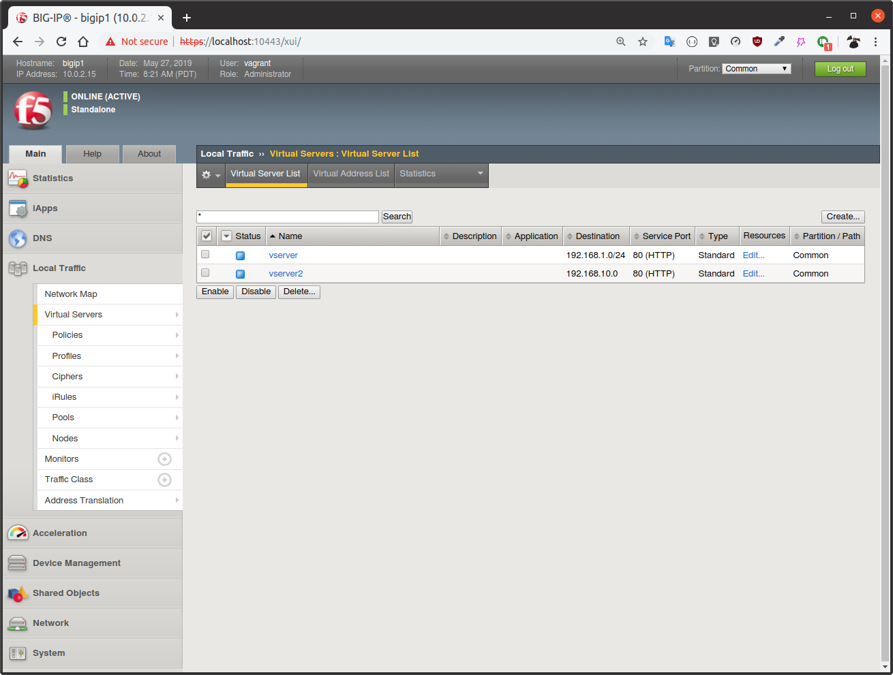
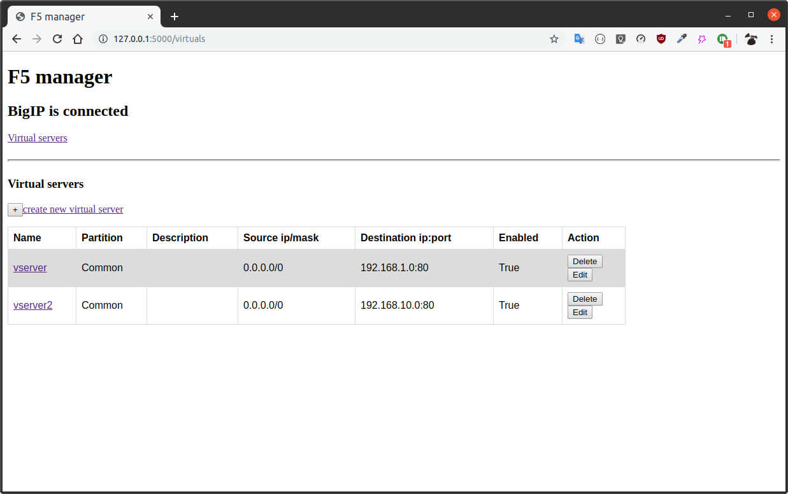
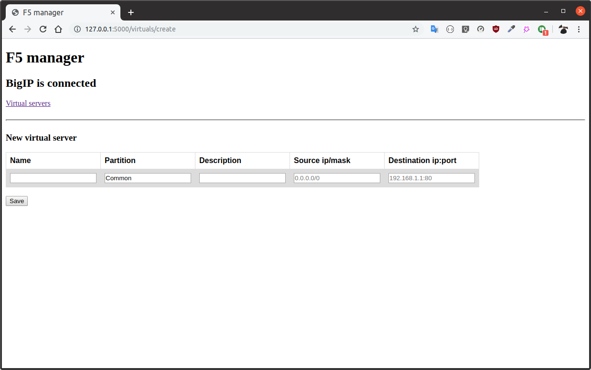
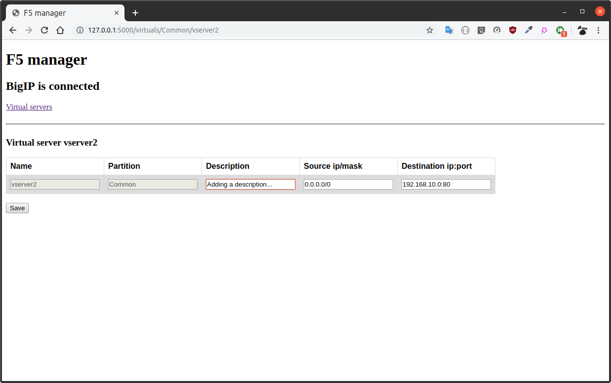

# Vagrant

## Définition

D'après le site officiel <https://www.vagrantup.com> :

> Vagrant is a tool for building and managing virtual machine environments in a single workflow. With an easy-to-use workflow and focus on automation, Vagrant lowers development environment setup time, increases production parity, and makes the "works on my machine" excuse a relic of the past.

Vagrant est donc un outil de gestion d'environnement de machines virtuel. On peut démarrer et arrêter des machines en une simple commande. La configuration des machines se fait dans un seul fichier `Vagrantfile`. Des box (images) préconfigurées sont à disposition et peuvent-être télécharger et démarrer en une seule ligne de commande.

Vagrant fonctionne avec un système de virtualisation tiers. Ici nous utilisons VirtualBox.

## Configuration de la box F5-BIGIP

Tout d'abord, on va utiliser la box `boeboe/F5-BIGIP` <https://app.vagrantup.com/boeboe/boxes/F5-BIGIP>. Cependant le fichier Vagrantfile est un peu personnalisé, récupéré ici <https://github.com/f5devcentral/f5-vagrant-files/tree/master/bigip-13.0.0> et adapté à nos besoins. Le fichier en question est disponible dans les sources de l'application.

On peut ensuite démarrer la VM avec la commande suivante :

```bash
cd /path/to/Vagrantfile
vagrant up
```

Un fois la machine démarrée, on peut accéder à son interface web via <https://localhost:10443/xui/>. Les credentials par défaut pour se connecter sont **vagrant/vagrant**.

Il a fallut ensuite activer une licence de BIG-IP. Une licence gratuite d'essai a fait l'affaire.

Pour arrêter la machine, on peut utiliser la commande suivante :

```bash
vagrant halt
```

# F5 et BIGIP

Cette section détaille ce que sont F5 et BIGIP.

## F5

F5 est une entreprise spécialisé dans les équipements réseaux. Ces équipements ont pour OS TMOS, un OS maison offrant une certaine flexibilité grâce à une API ouverte. D'après le site de F5, TMOS fournit une intelligence unifiée, de la souplesse et de la programmabilité.

F5 est connu en partie pour avoir produite le premier load balancer dans les années 1990.

## BIGIP

BIGIP est le produit phare de F5. Il s'agit d'une plate-forme qui gère le réseau. Initialement, BIGIP s'occupait de faire du load balancing, mais aujourd'hui il dispose de bien plus de fonctionnalités. On peut trouver sur le site les exemples suivants:

- BIG-IP Local Traffic Manager (LTM), qui assure la gestion intelligente du trafic, ainsi que la sécurité applicative, l'accélération et l'optimisation avancées.
- BIG-IP DNS, qui oriente les utilisateurs vers le centre de données le plus performant pour optimiser les performances applicatives. Sécurise votre infrastructure et maintient les applications en ligne lors de volumes de requête élevés et d'attaques par déni de service (DDoS) distribuées.
- BIG-IP Access Policy Manager (APM), qui intègre et unifie l'accès utilisateur sécurisé aux applications.
- BIG-IP Application Security Manager (ASM), qui donne la flexibilité nécessaire pour déployer les services de pare-feu d'application Web (WAF) à proximité des applications, de sorte qu'elles soient protégées partout où elles se trouvent.
- ...

BIGIP peut être embarqué dans un équipement spécifique, installer sur un server en tant que logiciel, ou intégré dans un cloud public ou privé. Dans notre cas, on utilise la version logicielle installée sur une machine virtuelle.

Dans cette application, on va se concentrer sur la gestion du module LTM de BIGIP. C'est à dire la partie Load Balancing, mais aussi la sécurité et l'analyse du traffic.

On peux accéder au dashboard de BIGIP qui tourne dans la VM vagrant à l'adresse suivante : <https://localhost:10443/xui/>.



# Application

Cette partie détaille les différents aspects de l'application développée, d'abord avec l'interface utilisant le SDK F5, puis l'API REST exposant cette interface, et enfin un petit site web démontrant le fonctionnement de l'API REST.

## Interface du SDK F5

Afin de gérer la plate-forme BIGIP, F5 met à disposition un SDK python. On peut l'installer avec pip :

```bash
pip install f5-sdk
```

La documentation accompagnée de quelques exemples peut-être trouvée sur <https://f5-sdk.readthedocs.io/en/latest/>. Les exemples sont simple à comprendre et mettre en place, cependant, pour les éléments où il n'y a pas d'exemples, les paramètres des fonctions ne sont pas documenté et doivent être un peu deviné. C'est pourquoi cela prend du temps de trouver quelque chose qui fonctionne.

En premier lieu, il faut créer une connection à l'hôte BIGIP, qui dans ce cas tourne sur notre propre machine. Ceci se fait comme suit:

```python
mgmt = ManagementRoot("localhost", "vagrant", "vagrant", port=10443)
```

A partir de cet objet `mgmt` nous pouvons lancer des requêtes sur l'hôte BIGIP. Dans cette application, en l'état actuel, il n'est possible de gérer uniquement les _Virtual servers_ de BIGIP. Les _Virtual servers_ sont identifiable par la paire Partition-Name. Les opérations possible sont:

- `get_virtuals` qui retourne une collection de tous les _Virtual servers_ de BIGIP
- `get_virtual` qui retourne seulement celui qui possède le nom et la partition donnés en paramètre
- `create_virtual` qui crée un _Virtual server_ avec les arguments passés en paramètre
- `update_virtual` qui met à jour les champs spécifiés dans les paramètre de celui qui possède le nom et la partition donnés en paramètre
- `delete_virtual` qui supprime celui qui possède le nom et la partition donnés en paramètre

## API REST

Tout d'abord, qu'est-ce qu'une API REST ?

Une API REST est un service web sont une manière d'exposer des ressources sur le web. On peut y accéder à partir d'une URL. Il est possible d'effectuer les opérations CRUD standard, c'est à dire CREATE, READ, UPDATE, DELETE.

L'implémentation de cette API REST dans l'application a été réalisé à l'aide du micro framework python Flask, et plus précisément l'extension [Flask-RESTful](https://flask-restful.readthedocs.io/en/latest/index.html).

Cette extension permet de créer facilement une API. On déclare des classes héritant de Resource, et on ajoute les méthodes correspondantes aux verbes HTTP que l'on souhaite. Le tableau suivant résume les fonctionnalités de l'API.

| Resource    | HTTP verb | méthode                 | lien                               |
| ----------- | --------- | ----------------------- | ---------------------------------- |
| VirtualList | GET       | get()                   | /api/viruals                       |
| VirtualList | POST      | post()                  | /api/viruals                       |
| Virtual     | GET       | get(partition, name)    | /api/virual/\<Partition\>/\<Name\> |
| VirtualList | PUT       | put(partition, name)    | /api/virual/\<Partition\>/\<Name\> |
| VirtualList | DELETE    | delete(partition, name) | /api/virual/\<Partition\>/\<Name\> |

Pour chacune de ces méthodes, les paramètres de la requête sont parser, puis on fait appel aux fonctions correspondantes f5-manager, la classe faisant l'interface avec le SDK.

Par exemple pour la première option du tableau, le code est le suivant :

```python
class VirtualList(Resource):
    def get(self):
        virtuals = f5man.get_virtuals()
        data = []
        for v in virtuals:
            data.append(
                {
                    "name": v.raw["name"],
                    "partition": v.raw["partition"],
                    "enabled": True if "enabled" in v.raw else False,
                    "source": v.raw["source"],
                    "destination": v.raw["destination"].split("/")[-1],
                    "description": v.raw["description"]
                    if "description" in v.raw
                    else "",
                }
            )
        return jsonify(data)
```

En l'état actuelle, l'API ne supporte pas toutes les option possibles pour les _Virtual servers_, mais uniquement les suivantes: name, partition, enabled, source, destination, description. Comme expliqué précédemment, les noms des _keyword args_ qu'il faut passer au fonctions du SDK ne sont pas listé dans la documentation. De plus, le champ enabled est en lecture uniquement. Il n'est pas possible de changer l'état enabled depuis cette API.

## Website

Afin de démontrer le fonctionnement de cette API REST, un site web a été créé. Il permet d'afficher une liste des _Virtual servers_, les éditer, les supprimer ou en créer de nouveau.







Ce site web est réalisé avec Flask. Pour chaque requête sur une des pages du site, dans la méthode associée, un requête sera envoyé à l'API REST et les résultats (si existant) seront renvoyé dans la réponse. Par exemple, pour l'affichage de la liste des servers :

```python
import requests as r

@app.route("/virtuals")
def virtual_servers_list():
    result = r.get("http://localhost:5000/api/virtuals")
    return render_template(
        "virtuals/virtuals.html", connected=f5man.is_connected(), virtuals=result.json()
    )
```

Ici, une requête GET est envoyé au endpoint `/api/virtuals` par la bibliothèque python `requests`. Le résultat de cette requête en ensuite renvoyé comme paramètre de la fonction `render_template()`.

Grâce à Jinja2, le moteur de template intégré à Flask, on peut accéder à ces données directement depuis la page HTML.

```html
... 
<tr>
  <td>
    <a href="/virtuals/{{ item.partition }}/{{ item.name }}">
      {{ item.name }}
    </a>
  </td>
  <td>{{ item.partition }}</td>
  <td>{{ item.description }}</td>
  <td>{{ item.source }}</td>
  <td>{{ item.destination }}</td>
  <td>{{ item.enabled }}</td>
  <td>
    <div style="display: inline">
      <form action="/virtuals/{{ item.partition }}/{{ item.name }}" method="POST">
        <input type="hidden" name="action" value="delete" />
        <input type="submit" value="Delete" />
      </form>
      <a href="/virtuals/{{ item.partition }}/{{ item.name }}">
        <button>Edit</button>
      </a>
    </div>
  </td>
</tr>
 ...
```

# Conclusion

Le projet est plutôt un projet proof of concept, car plusieurs choses manquent. Pourtant, il a permis de prouver qu'une application telle que celle ci est réalisable. Il est facilement extensible à d'autre type de resource. La raison pour laquelle seuls les _Virtual servers_ ont été traité est principalement le manque de temps pour approfondir les autres ressources.

## Ce qui a été fait

- Connexion à une instance BIGIP
- Gestion des _Virtual servers_ (certains paramètres) via une API REST
  - Liste
  - Création
  - Mise à jour
  - Suppression
- Site web utilisant l'API REST permettant de gérer les virtual server à partir d'un navigateur.

## Améliorations possibles

- Ajouter les paramètres manquants aux _Virtual servers_.
- Ajouter la gestion d'autres ressources, telles que les pools, les nodes, les monitor, et les autres ressource disponible dans le SDK.
- Importer/exporter les configurations.
